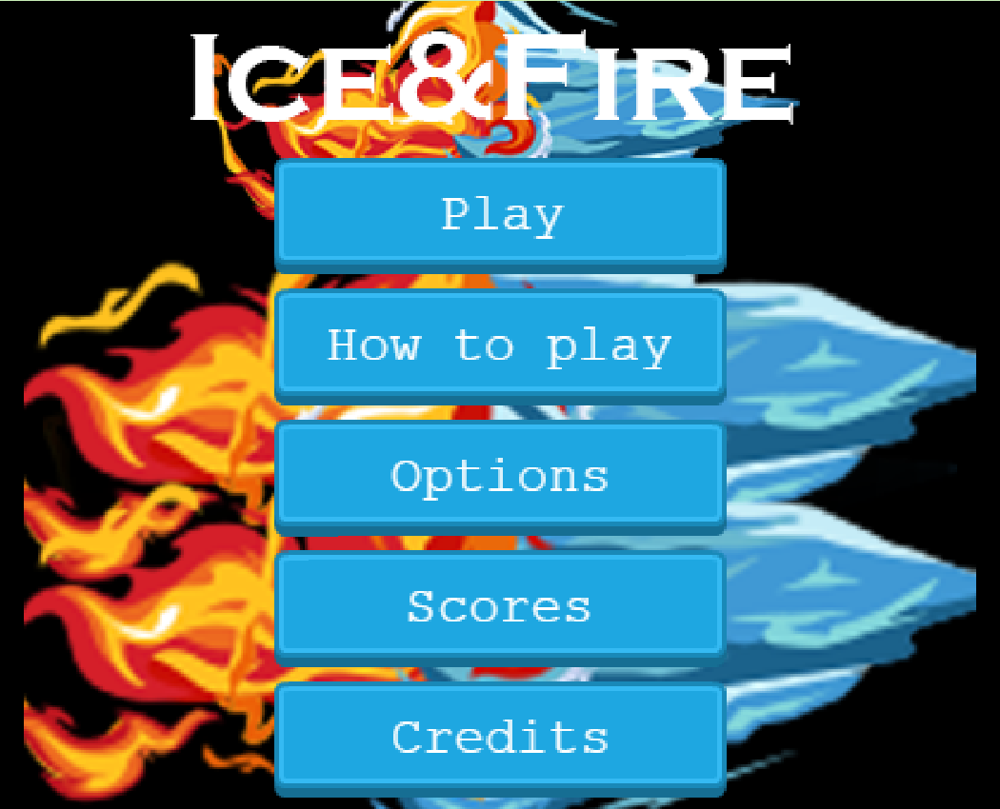
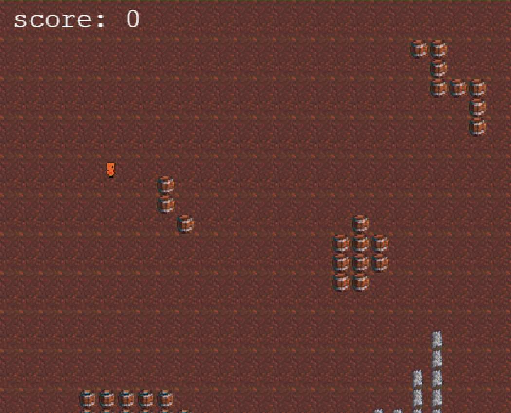
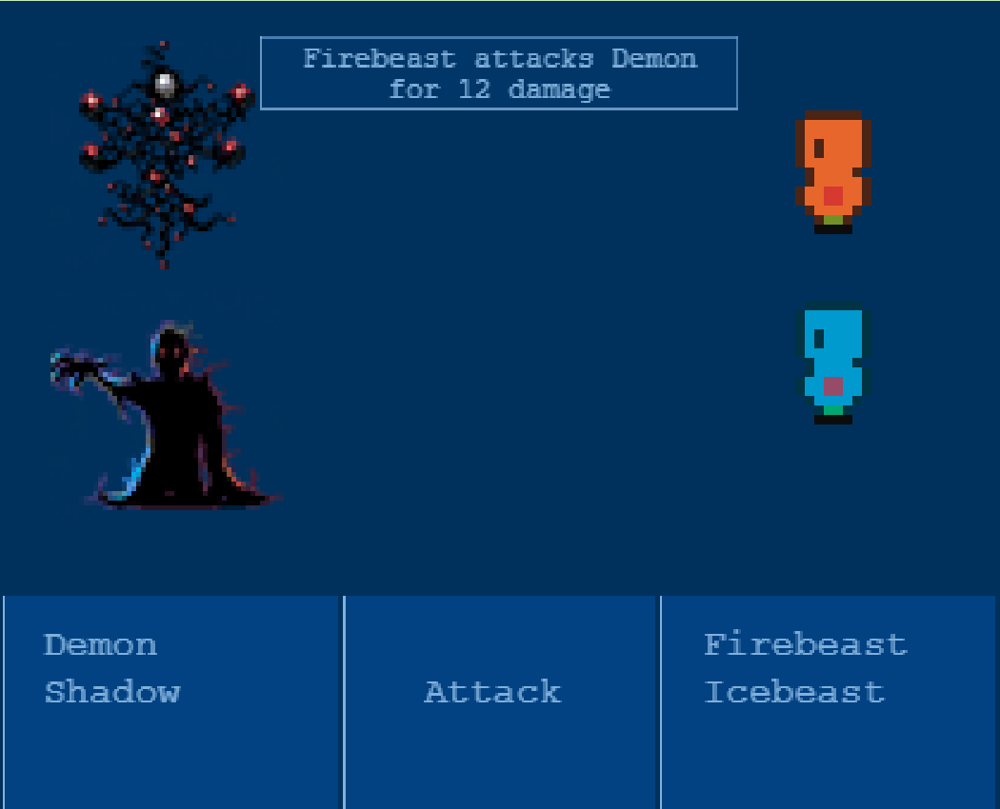

# RPG Game

This is an RPG game where the user is capable to move around the map and find enemies to fight randomly. The user will have 2 turns using a fire beast and an ice beast, and the user will have to fight until the enemies or the beasts die.





## Live Demo

[Live version](https://vigorous-feynman-e24bb9.netlify.app/)

## Built With

- Javascript
- Phaser 3
- Webpack
- Babel

## Game Functionality

### Concept
Control to the warrior to find monsters around the map.
Kill as many shadows and demons as possible.
Avoid being killed by the 2 different monsters that exist in the world.
Controls
You need a keyboard to control the Player Ship.

Press ⬆️ to move up.

Press ⬇️ to move down.

Press ➡️ to go right.

Press ⬅️ to go left.

When finding a monster.

Press ⬆️ or ⬇️ to select the monster you want to attack.
Press Space to attack the enemies.

### Assets

| Asset | Description |
|---------|-------------|
|    | Fighting beasts |
|    | Enemies |

## 👷 Getting Started

To get a local copy up and running follow these simple example steps.

### Setup

- Open the console
- Download or git clone git@github.com:karmaester/RPG-Game.git
- cd RPG-Game

### Available Commands

| Command | Description |
|---------|-------------|
| `npm install` | Install project dependencies |
| `npm start` | Build project and open web server running project |
| `npm run build` | Builds code bundle with production settings (minification, uglification, etc..) |

### Testing

Run the following commands

```
   npm run test
```

### Github Actions

To make sure the linters' checks using Github Actions work properly, you should follow the next steps:

1. On your recent repo, enable the GitHub Actions in the Actions tab.
2. Create the `feature/branch` and push.
3. Open a PR from the `feature/branch` when your work is done.

## Author

👤 **Khristian Rojas**

- Github: [@githubhandle](https://github.com/karmaester)
- Twitter: [@twitterhandle](https://twitter.com/karmaendlich)
- Linkedin: [linkedin](https://www.linkedin.com/in/khristian-rojas/)

## 🤝 Contributing

Contributions, issues, and feature requests are welcome!

Feel free to check the [issues page](https://github.com/karmaester/RPG-Game/issues).

## Show your support

Give a ⭐️ if you like this project!

## Acknowledgments

- Microverse
- Stand up Team
- TSEs

## 📝 License

This project is [MIT](https://opensource.org/licenses/MIT) licensed.
